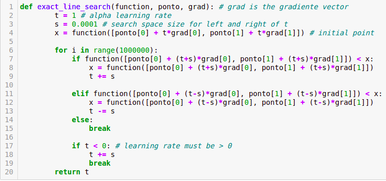

# Install
## Install python 3.9 and virtual venv in ubuntu ^18.04
sudo apt update  
sudo apt install python3.9  
sudo Install venv libs for python tools  
sudo  apt-get install python3.9-dev python3.9-venv  

## create virtual venv
python3.9 -m venv .env  

## run virtual venv
source .env/bin/activate  

# Run aplication
## Install libraries
pip install -r requirements.txt

# Descent Methods

This repository contains the Python code for the implementations of the following minimization algorithms: 

**Descent gradient** (with backtranking, exact line search);  
**Steepest descent** (with squared norm);  
**Newton's Method** (with backtracking).  

**The function to be minimized is:**  
*f(x1, x2)* = exp(x1 + 3x2 - 0.1) + exp(x1 - 2x2 - 0.1) + exp(-x1 - 0.2)  

# Exact Line Search
The exact line search goal is find the learning rate (t), where *alpha* is given by: 

***alpha = argmin f(x + alpha * ∆x) | alpha > 0***

To find the *learning rate* (alpha) using *exact line search* for the *function f(x1, x2)*, the *hill climbing* algorithm was used. As *f(x1, x2)* cannot be solved analytically, so this approach was the simplest and fastest found. 

The *hill climbing* algorithm basically looks at the left and rightmost value of the current point *x*. The value that decreases the result of the function will be considered the new current *x*. In our case we are varying the *alpha* value. 

# Gradient Descent

# Steepest Descent

# Newton Method